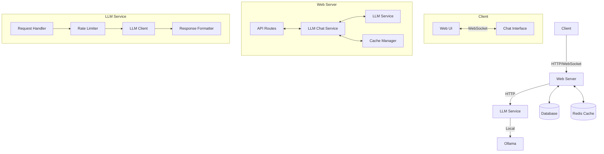

# Architecture Overview

This document provides a high-level overview of the LLM integration architecture in the Scrambled Eggs application.

## System Architecture



## Core Components

### 1. LLM Service
- **Purpose**: Handles communication with the Ollama API
- **Key Features**:
  - Connection management
  - Request/response handling
  - Error handling and retries
  - Rate limiting

### 2. LLM Chat Service
- **Purpose**: Manages chat-specific functionality
- **Key Features**:
  - Conversation state management
  - Message history
  - Context window management
  - Response generation

### 3. Web Server
- **Purpose**: Handles client communication
- **Key Features**:
  - WebSocket endpoints for real-time chat
  - REST API for non-real-time operations
  - Authentication and authorization
  - Request validation

### 4. Cache Layer
- **Purpose**: Improves performance and reduces LLM calls
- **Key Features**:
  - Response caching
  - Conversation state caching
  - Rate limit tracking

## Data Flow

1. **Message Sending**
   ```mermaid
   sequenceDiagram
       participant C as Client
       participant W as Web Server
       participant L as LLM Chat Service
       participant M as LLM Service
       participant O as Ollama
       
       C->>W: Send message (WebSocket)
       W->>L: Process message
       L->>M: Generate response
       M->>O: API Request
       O-->>M: Response
       M-->>L: Formatted response
       L->>W: Update conversation
       W->>C: Send response (WebSocket)
   ```

2. **Conversation Management**
   - New conversations create a unique context
   - Messages are added to the conversation history
   - Context window is managed to maintain performance

## Security Considerations

1. **Authentication**
   - JWT-based authentication for API access
   - WebSocket connection authentication
   - Rate limiting to prevent abuse

2. **Data Protection**
   - Sensitive data encryption
   - Secure WebSocket connections (WSS)
   - Input validation and sanitization

3. **LLM Security**
   - Prompt injection prevention
   - Output validation
   - Content filtering

## Performance Considerations

1. **Caching**
   - Response caching
   - Model output caching
   - Conversation state caching

2. **Optimizations**
   - Batch processing of requests
   - Streaming responses
   - Efficient context management

3. **Monitoring**
   - Response times
   - Error rates
   - Resource usage

## Scaling

### Vertical Scaling
- Increase server resources
- Use more powerful LLM instances
- Optimize model parameters

### Horizontal Scaling
- Load balancing
- Distributed caching
- Sharded conversation storage

## Integration Points

### External Services
- **Ollama**: Local LLM inference
- **Redis**: Caching and rate limiting
- **Database**: Conversation storage

### Internal Components
- **Authentication Service**: User verification
- **Message Queue**: For async processing
- **Analytics**: Usage tracking

## Monitoring and Logging

### Metrics
- Request/response times
- Error rates
- Token usage
- Resource utilization

### Logging
- Request logging
- Error logging
- Audit trails

## Deployment

### Development
- Local Ollama instance
- In-memory caching
- File-based storage

### Production
- Containerized services
- Managed Redis instance
- Persistent storage
- Monitoring and alerting

## Future Enhancements

1. **Multi-modal Support**
   - Image generation
   - Document processing

2. **Advanced Features**
   - Fine-tuning interface
   - Custom model support
   - Plugin system

3. **Performance**
   - Model quantization
   - Better context management
   - Optimized inference

## Dependencies

### Core Dependencies
- Python 3.8+
- Ollama
- Redis (optional)

### Python Packages
- `requests`: HTTP client
- `websockets`: WebSocket support
- `pydantic`: Data validation
- `fastapi`: Web framework
- `python-dotenv`: Environment management

## Conclusion

This architecture provides a flexible and scalable foundation for integrating LLM capabilities into the Scrambled Eggs application. The modular design allows for easy extension and maintenance, while the focus on security and performance ensures a robust user experience.
