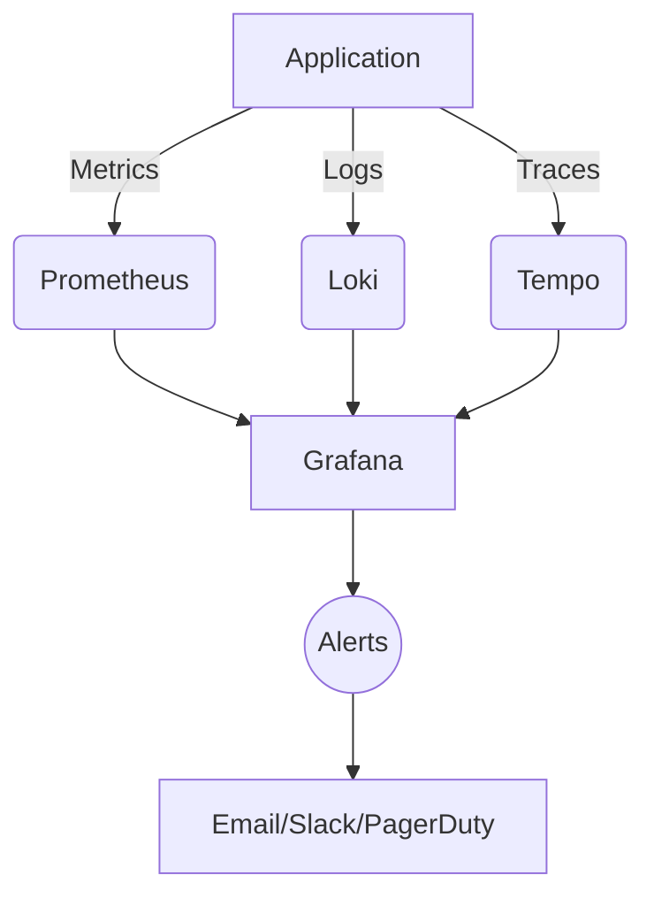

# Production Monitoring Guide

This guide covers the monitoring and alerting setup for the Scrambled Eggs application in production.

## Monitoring Stack



## Key Metrics to Monitor

### Application Metrics
- **Request Rates**: Total requests per second
- **Error Rates**: HTTP error rates (4xx, 5xx)
- **Latency**: P50, P90, P99 response times
- **LLM Metrics**:
  - Response times
  - Token usage
  - Error rates
  - Rate limit hits

### System Metrics
- CPU/Memory usage
- Disk I/O
- Network traffic
- Database connections

### Business Metrics
- Active users
- Messages processed
- API usage

## Setting Up Alerts

### Critical Alerts (P0)
- Service down
- Database connection failures
- 5xx errors > 1% of requests
- High error rates from LLM provider

### Warning Alerts (P1)
- High latency (>1s p99)
- Approaching rate limits
- High CPU/Memory usage (>80%)
- Disk space low (<20% free)

## Logging Best Practices

### Structured Logging
```python
import logging
from pythonjsonlogger import jsonlogger

logger = logging.getLogger(__name__)
logger.setLevel(logging.INFO)

# Configure JSON formatter
formatter = jsonlogger.JsonFormatter(
    '%(asctime)s %(levelname)s %(name)s %(message)s',
    timestamp=True
)

# Add console handler
ch = logging.StreamHandler()
ch.setFormatter(formatter)
logger.addHandler(ch)

# Example usage
logger.info("User logged in", extra={
    'user_id': user.id,
    'ip': request.remote_addr,
    'user_agent': request.user_agent.string
})
```

### Log Levels
- **DEBUG**: Detailed debug information
- **INFO**: Important business processes
- **WARNING**: Unexpected but handled events
- **ERROR**: Failed operations
- **CRITICAL**: System-level failures

## Performance Monitoring

### Database Queries
- Slow query logging
- Query execution plans
- Connection pool metrics

### Cache Performance
- Hit/miss ratios
- Memory usage
- Eviction rates

## Incident Response

### Runbook
1. **Identify** the issue using dashboards
2. **Contain** the impact
3. **Mitigate** the issue
4. **Resolve** the root cause
5. **Document** the incident

### Post-Mortem Template
```markdown
# Incident Report: [Title]

## Summary
- **Date/Time**: 
- **Duration**: 
- **Impact**: 

## Timeline
- [ ] 00:00 - First detection
- [ ] 00:05 - Initial triage
- [ ] 00:30 - Mitigation in progress
- [ ] 01:00 - Resolution

## Root Cause
[Detailed analysis]

## Impact
[Affected systems/users]

## Action Items
- [ ] Item 1
- [ ] Item 2

## Prevention
[Steps to prevent recurrence]
```

## Monitoring Tools

### Prometheus Queries

**High Error Rate**
```promql
rate(http_requests_total{status=~"5.."}[5m])
/
rate(http_requests_total[5m])
> 0.01  # 1% error rate
```

**High Latency**
```promql
histogram_quantile(0.99, 
  sum(rate(http_request_duration_seconds_bucket[5m]))
  by (le, endpoint)
) > 1  # 1 second
```

### Grafana Dashboards
1. **Application Overview**
   - Request rates
   - Error rates
   - Latency percentiles

2. **LLM Performance**
   - Response times
   - Token usage
   - Error rates

3. **System Health**
   - CPU/Memory usage
   - Disk I/O
   - Network traffic

## Alerting Rules

### Prometheus Alert Rules
```yaml
groups:
- name: application
  rules:
  - alert: HighErrorRate
    expr: rate(http_requests_total{status=~"5.."}[5m]) / rate(http_requests_total[5m]) > 0.01
    for: 5m
    labels:
      severity: critical
    annotations:
      summary: "High error rate on {{ $labels.instance }}"
      description: "Error rate is {{ $value }}%"

  - alert: HighLatency
    expr: histogram_quantile(0.99, rate(http_request_duration_seconds_bucket[5m])) > 1
    for: 5m
    labels:
      severity: warning
    annotations:
      summary: "High latency on {{ $labels.endpoint }}"
      description: "P99 latency is {{ $value }}s"
```

## Best Practices

1. **Alert Fatigue**
   - Only alert on actionable items
   - Use different severity levels
   - Implement alert deduplication

2. **Dashboard Design**
   - Keep it simple and focused
   - Use appropriate visualizations
   - Include relevant context

3. **Performance Budgets**
   - Set targets for key metrics
   - Monitor trends over time
   - Alert on regressions
